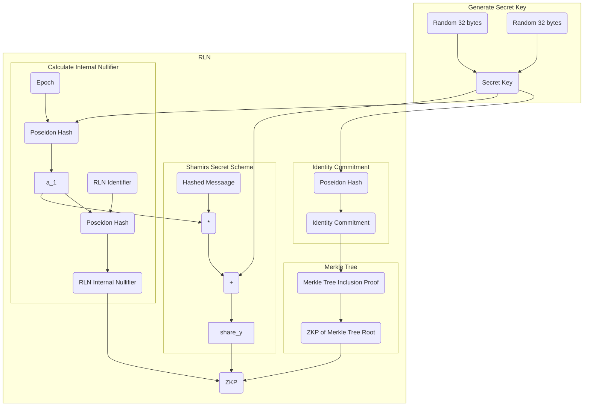

```mermaid
flowchart TB

    subgraph Generate Secret Key
      random0(Random 32 bytes) --> a_0(Secret Key)
      random1(Random 32 bytes) --> a_0
    end

    subgraph RLN

      subgraph Identity Commitment
        a_0 --> h0(Poseidon Hash)
        h0 --> q(Identity Commitment)
      end

      subgraph Calculate Internal Nullifier
        a_0 --> h1(Poseidon Hash)
        epoch(Epoch) --> h1
        h1 --> a_1
        rln_identifier(RLN Identifier) --> h2(Poseidon Hash)
        a_1 --> h2
        h2 --> nullifier(RLN Internal Nullifier)
      end

      subgraph Merkle Tree
        q --> merkle_tree_inclusion_proof(Merkle Tree Inclusion Proof)
        merkle_tree_inclusion_proof --> root(ZKP of Merkle Tree Root)
      end

      subgraph Shamirs Secret Scheme
        a_0 --> plus(+)
        a_1 --> multiply(*)
        x(Hashed Messaage) --> multiply
        multiply --> plus
        plus --> share_y
      end

        nullifier --> proof(ZKP)
        root --> proof
        share_y --> proof
    end

```
