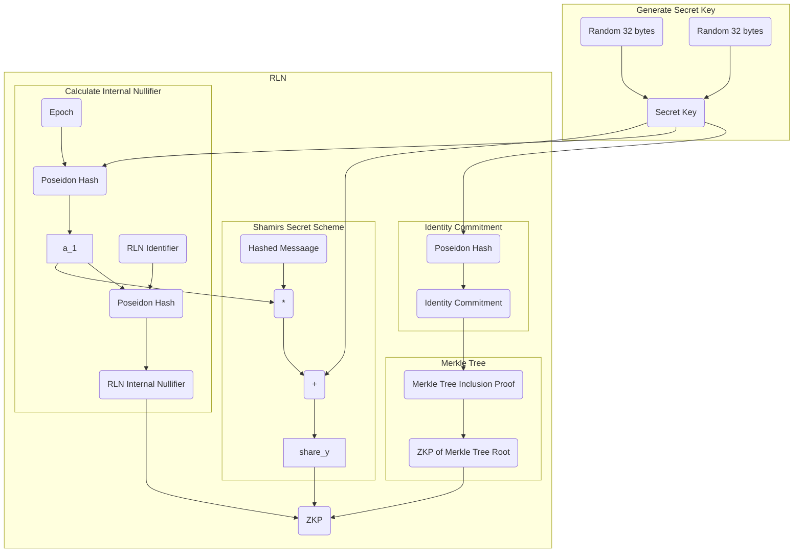

# Technical side of RLN

*This topic is a less strict version of specifications. If you want more formal description, you can find specs in the [references](./references.md). Also, if you're not familiar with Shamir's Secret Sharing scheme, you can [read it here](./sss.md).*

___

As it's been said **RLN** consists of three parts:
* User registration
* User interaction (signalling)
* User removal (slashing) - additional part

Well, let's discuss them.

## User registration
First part of **RLN** is registration. There is nothing special in **RLN** registration; it's almost the same process as in other protocols/apps with anonymous environments: we need to create Merkle Tree and every participant must submit the `commitment` and place it in the Merkle Tree, and after that to interact with the app every participant will create zkProof's, that he is a *member of the tree* (we use *Incremental Merkle Tree*, as it more *GAS-effective*).

So, each member randomly generate secret key, that is denoted by `a_0`. Identity commitment `q` is the hash (Poseidon) of the secret key: `q = Poseidon(a_0)`.

**RLN** would have no sense if there was no punishment for spam, that's why to become a member a user have to provide a certain form of stake. So, whoever has our `a_0` can "slash" us. 

The slight difference is that we must enable *secret sharing* scheme (to split the `commitment` into parts). We need to come up with polynomial. For simplicity we use linear polynomial (e.g. `f(x) = kx + b`). Therefore, having two points we can recover the polynomial. 

Our polynomial will be: `A(x) = (a_0, a_1)`, where `a_1 = Poseidon(a_0, epoch)`.

Less strict: `A(x) = a_1 * x + a_0`.

`epoch` is just a simple identificator (also called *external nullifier*). And each epoch there is a polynomial with new `a_1` and same `a_0`. 

## Signalling
Now, that the user is registered, he wants to interact with the system. Imagine, that the system is an *anonymous chat* and the interaction is the sending of messages. 
So, to send a message user have to come up with *share* - the point `(x, y)` on her polynomial. 
We denote: `x = Poseidon(message), and y = A(x)`. 

Thus, if in the same epoch user sends more than one message, his polynomial, and therefore his secret (`a_0`) can be recovered.

Of course, we somehow must prove that our `share = (x, y)` is valid (that this is really a point on our `polynomial = A(x)`), as well as we must prove other things are valid too, that's why we use zkSNARK. An explanation of the zk-circuits can be found in the next topic.

## Slashing
As it's been said, if a user sends more than one message, everyone else will be able to recover his secret, slash him and take his stake.

## Some important notes
There are also `nullifier` and `rln_identifier` which can be found in the **RLN** protocol/circuits.

So, `rln_identifier` is just a random value, that's unique per **RLN** app. It's used for additional cross-application security - to protect the user secrets being compromised if they use the same credentials accross different **RLN** apps. If `rln_identifier` is not present, the user uses the same credentials and sends a different message for two different **RLN** apps using the same epoch, then their secret key can be revealed. With adding the `rln_identifier` field we obscure the nullifier, so this kind of attack cannot happen. The only kind of attack that is possible is if we have an entity with a global view of all messages, and they try to brute force different combinations of x and y shares for different nullifiers.

Now, imagine, there are a lot of users sending messages and after each received message we need to check if any member can be slashed. For that we use all combinations of received *shares* and try to recover the polynomial. This is naive and non-optimal way. What if we have some mechanism, which will tell us about the connection between a person and his messages, while not revealing him.
For that we can use `nullifier`. `nullifier = Poseidon(a_1, rln_identifier)` and it's public, thus, if user sends more than one message, it will be immediately visible to everyone.

Also, in our example (and actually current [zk-chat](https://github.com/njofce/zk-chat) implementation) we use linear polynomial, but SSS allows us to use various degree polynomials, therefore we can implement a protocol, where more than one signal can be sent in one epoch. For that you can read [specification](https://hackmd.io/7GR5Vi28Rz2EpEmLK0E0Aw?view) by Blagoj; there are also [circuits](https://github.com/privacy-scaling-explorations/rln/tree/master/circuits) implemented for various degree poynomials too.

# Diagram

