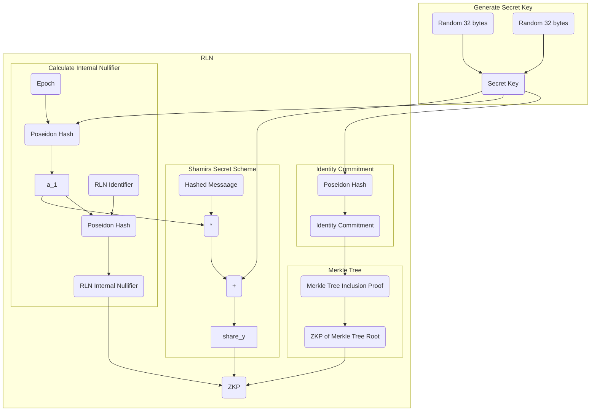

# Technical side of RLN

*This topic is a less strict version of specifications. If you want more formal description, you can find specs in the [references](./references.md)*

___

As it's been said **RLN** consists of three parts:
* User registration
* User interaction (signalling)
* User removal (slashing) - additional part

Well, let's discuss them.

## User registration
First part of **RLN** is registration. There is nothing special in **RLN** registration; it's almost the same process as in other protocols/apps with anonymous environments: we need to create Merkle Tree and every participant must submit the `commitment` and place it in the Merkle Tree, and after that to interact with the app every participant will create zkProof's, that she is a *member of the tree*.

We'll use *Incremental Merkle Tree*, as it more *GAS-effective*.

The slight difference is that we must enable *secret sharing* scheme (to split the `commitment` into parts). Thus, generation of the `commitment` is different.

Each member randomly generate secret key, that is denoted by `a_0`. Identity commitment `q` is the hash (Poseidon) of the secret key: `q = Poseidon(a_0)`.

RLN would have no sense if there was no punishment for spam, that's why to become a member a user have to provide a certain form of stake.

# Diagram

