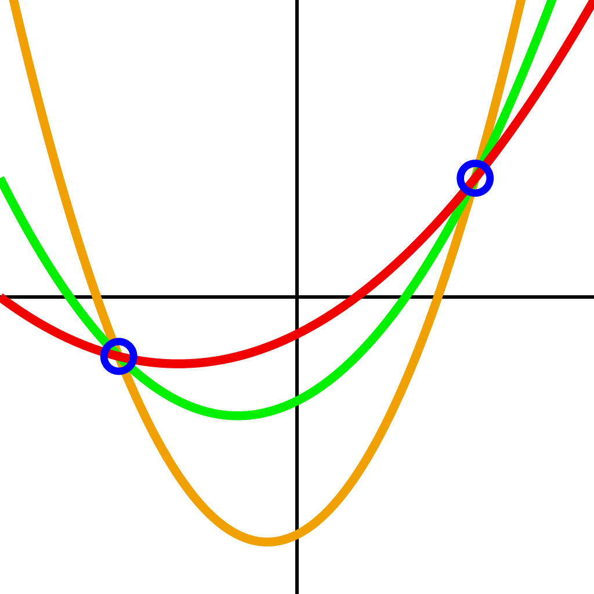

# Shamir's Secret Sharing Scheme

*This topic is an explanation of **Shamir's Secret Sharing** scheme (**SSS**), also known as \\((k, n)\\) threshold secret sharing scheme. **SSS** is one of the critical parts of **RLN**.*

## Overview
Imagine if you have some important secret (secret key) and you don't want to store it anywhere. For that, you can use the *SSS* scheme. It allows you to split this secret into \\(n\\) parts (each individual part doesn't give any information about the secret) and restore this secret upon presentation of \\(k\\) \\((k <= n)\\) parts.

For example, you have a secret that you want to split into \\(n\\) parts/shares. You can divide these shares between your friends (1 share to 1 friend). Now when \\(k\\) of your friends reveal their share, you can restore the secret.

This scheme is also called \\((k, n)\\) *threshold secret sharing scheme*.

This scheme is possible due to *polynomial interpolation* (especially Lagrange interpolation). Let's describe how *Lagrange interpolation* works and how it's used in a *SSS* scheme.

## Polynomial (Lagrange) interpolation

*Interpolation* is a method of constructing (or restoring) new points/values (or function) based on the range of a set of known points/values (f.e. we can restore the line (linear function) from two points that are from this line). The previous example describes how that works. 

    

    <i>An unlimited number of parabolas (second-degree polynomials) can be drawn through two points. To choose the only one, you need a third point.</i>

Thus, if we have a polynomial \\(f(x) = 3x + 2\\), we only need two points from this polynomial to restore it. Let's peek two random \\(x\\) values and calculate \\(f(x)\\):
* For \\(x = 1\\) we have \\(f(1) = 3 * 1 + 2 = 5\\)
* For \\(x = 10\\) we have \\(f(10) = 32\\)

Now we have to shares: \\((1, 5)\\) and \\((10, 32)\\). If we draw a graph based on these two shares, we can easily see that this is the same line (function):

    

We also can "restore" the function analytically. For that let's denote: \\[f(x) = y_1 * \frac{x - x_2}{x_1 - x_2} + y_2 * \frac{x - x_1}{x_2 - x_1}\\]
where \\(x_1 = 5, x_2 = 10, y_1 = 5, y_2 = 32\\). If we make substitution we got: \\[f(x) = 3x + 2 \\]
which is the same polynomial.

The same technique can be made with every polynomial. Main thing to remember is that we need \\(n + 1\\) points to interpolate \\(n\\)-degree polynomial.

Now that we know how interpolation works, we can learn how it is used in SSS.

## Shamir's Secret Sharing

To create the **SSS** construct, we must choose \\((k, n)\\), where \\(n\\) is the number of shares we want to get from the secret and \\(k\\) is the number of shares required to restore the secret. The degree of the "secret" polynomial is \\(k - 1\\) (covered in the previous section). 
Let's try to construct **SSS** with an example.

### Sharing
1. Our secret = \\(S = 30\\) 
2. As the linear polynomial used in current **RLN** implementations, let's set \\(k = 2\\) (2 points are enough to recover the polynomial); \\(n\\) is not that important, but we can make it any number, f.e. 3
3. The secret polynomial is: \\[f(x) = a_1 * x + a_0 \\]
where zero coefficient \\(a_0 = S\\), and \\(a_1\\) is some random number (f.e. 5); 
4. We must pick \\(n = 3\\) different points (shares) on that polynomial, for that we can pick three random \\(x\\) values (f.e. 5, 8, 16) and calculate \\(f(x)\\):
\\[f(5) = 5 * 5 + 30 = 55\\]
\\[f(8) = 5 * 8 + 30 = 70 \\]
\\[f(16) = 5 * 16 + 30 = 110 \\]
So, the shares are: \\((5, 55), (8, 70), (16, 110)\\)

### Recovering
We can take any two shares to recover (as described in the interpolation section) the "secret" polynomial. Zero coefficient (\\(a_0\\)) in the recovered polynomial is the secret \\(S\\).

## Important notes
Arithmetic in this topic is usual for us. However, in real life, **SSS** arithmetic is defined over some finite field. This means that all calculations are carried out modulo some big prime field. In fact, it happens by itself in Circom because the arithmetic there is defined over the finite field, too, so we don't need to do anything extra). 
