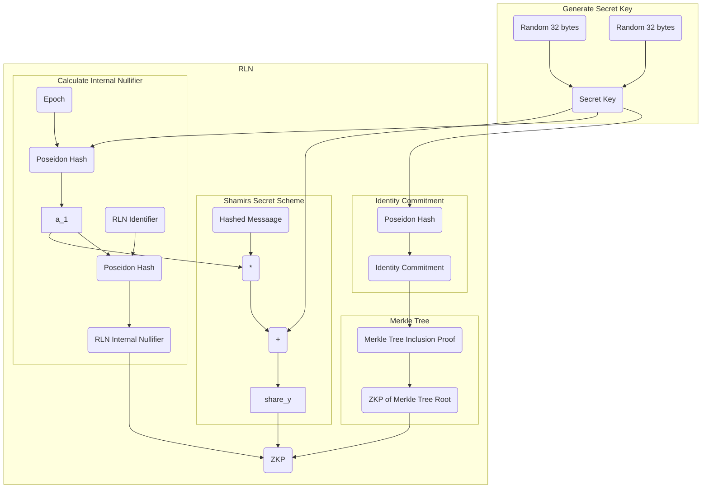

# What is Rate-Limiting Nullifier?

*This topic is a part of complete [overview](https://medium.com/privacy-scaling-explorations/rate-limiting-nullifier-a-spam-protection-mechanism-for-anonymous-environments-bbe4006a57d) by Blagoj*.

___

**RLN** is a construct based on zero-knowledge proofs that enables spam prevention mechanism for decentralized, anonymous environments. In anonymous environments, the identity of the entities is unknown.

The anonymity property opens up the possibility for spam attack and sybil attack vectors for certain applications, which could seriously degrade the user experience and the overall functioning of the application. For example, imagine a chat application, where users are anonymous. Now, everyone can write unlimited number of spam messages, while we don't have ability to kick this member, because the spammer is anonymous. 

**RLN** helps us identify and "kick" the spammer.

Moreover RLN can be useful not only to prevent a spam attacks, but in general, to limit users (in anonymous environments) in the number of actions (f.e. to vote or to make a bid).

# Circom Circuit for RLN

